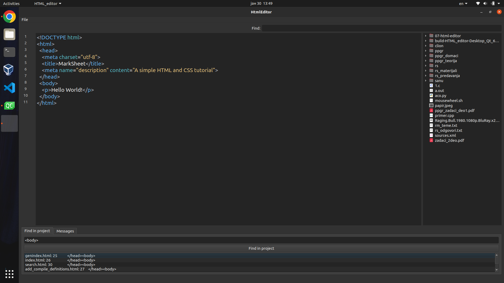

# HTML editor

##### Text editor for HTML documents. Basic "notepad" features along with syntax highlighting, validation, find in project, file tree view...

## Requirements 
- Qt version 6.4.
- Python library ``html5validator`` installed on your system. This is needed for HTML validation to work.

## Build manually

1. Clone the repository.
2. From the terminal, palace yourself inside the cloned repository.
3. Run ``qmake6 -makefile HTML_editor.pro``.
4. Run ``make``.
5. Run the program by executing the binary ``HTML_editor`` inside the current directory.

## Build with Qt Creator

1. Clone the repository.
2. Inside Qt Creator go to **File** > **Open File or Project** and open ``HTML_editor.pro``.
3. Build the project by going to **Build** > **Build Project "HTML_editor"**.
4. Run the program by going to **Build** > **Run** or by executing the binary created inside the build directory.

##### Authors:
<ul>
    <li><a href="https://gitlab.com/plave0">Pavle Ćirić 208/2019</a></li>
    <li><a href="https://gitlab.com/mi19019">Miloš Milićević 19/2019</a></li>
    <li><a href="https://gitlab.com/ilija-s">Ilija Stojanović 77/2019</a></li>
    <li><a href="https://gitlab.com/efen9">Natalija Filipoivć 117/2019</a></li>
</ul>
